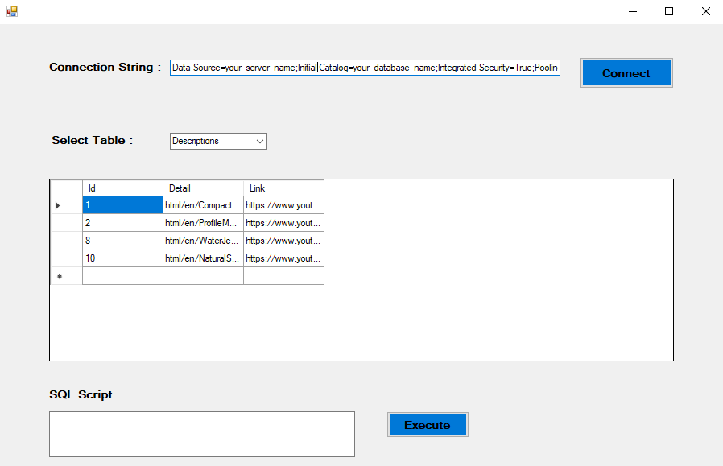
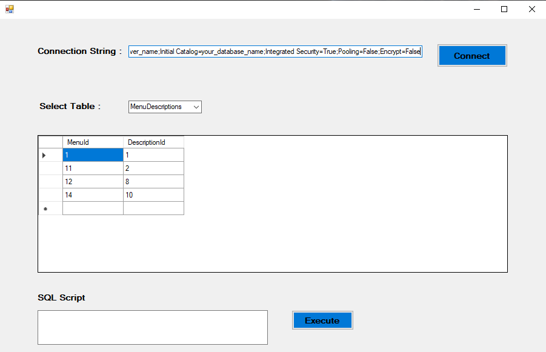

# DatabaseConnection

DatabaseConnection is a C# Windows Forms application that provides a user-friendly interface for interacting with SQL databases. The application allows users to connect to a SQL database, view table names, and display data from selected tables. Additional features such as table management and SQL script execution are planned for future updates.

<div align="center">
    
    
</div>

## Features
Database Connection: Easily connect to your SQL database using a connection string.
Table Viewing: View and select tables from the connected database.
Data Display: Display data from selected tables in a grid view.

## Planned Features:
SQL script execution
Table creation and deletion
Row operations (insert, update, delete)

## Getting Started

### Prerequisites
.NET Framework: Ensure that you have the .NET Framework installed on your machine.
SQL Server: An SQL Server instance should be available for connection.

### Installation
Clone the repository:
   ```sh
   git clone https://github.com/yourusername/DatabaseConnection.git
   ```

Open the solution file (DatabaseConnection.sln) in Visual Studio.
Build the project to restore NuGet packages and dependencies.

### Usage

Launch the application.
In the Connection String field, enter your SQL Server connection string. Example:
   ```sh
   Data Source=your_server_name;Initial Catalog=your_database_name;Integrated Security=True;Pooling=False;Encrypt=False
   ```
Click the Connect button to establish a connection to the database. You will see a success message upon successful connection.
Once connected, the application will fetch and display the list of tables in the database in a ComboBox.
Select a table from the ComboBox to view its data in the DataGridView.

## Contributing
If you would like to contribute to this project, please fork the repository and submit a pull request. Contributions such as bug fixes, feature additions, and documentation improvements are welcome!

## License
Distributed under the MIT License. See [MIT](LICENSE) for more information.
